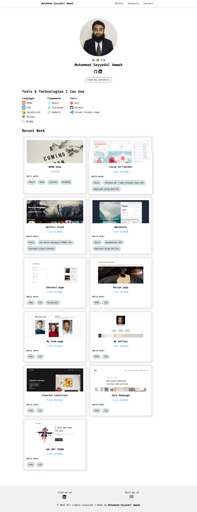

<h1 align="center">Portfolio</h1>

  <h3>
    <a href="https://sayyedulawwab.netlify.app/">
      Live
    </a>
     | 
    <a href="https://github.com/sayyedulawwab/portfolio">
      Code
    </a>
    
  </h3>

It is my portfolio website done while learning React.

  
Table of Contents

  <ul>
    <li><a href="#built-with">Built With</a></li>
    <li><a href="#contact">Contact</a></li>
  </ul>

### Built With

- [React](https://reactjs.org/)
- Deployed using [Netlify](https://www.netlify.com/)

## Contact

- Twitter: [@sayyedulawwab](https://twitter.com/sayyedulawwab)
- LinkedIn [@sayyedulawwab](https://www.linkedin.com/in/sayyedulawwab/)
