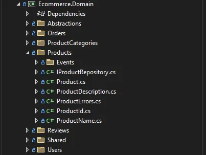

# A Comprehensive Guide to Designing an API from Scratch with ASP.NET Core and Clean Architecture, Domain Driven Design (DDD), CQRS

Designing a robust API involves balancing scalability, maintainability, and best practices. In this guide, I share my experience of building an API from scratch using ASP.NET Core, Clean Architecture, Domain-Driven Design (DDD), and Command Query Responsibility Segregation (CQRS).


Before starting a long-term project, it is crucial to choose a solid architectural pattern. For this guide, we’ll use **Clean Architecture** as it makes the project well-structured, maintainable and extensible over time by separating concerns. It organizes the solution into four key projects:

1. **Domain (Class Library):** Contains the core business logic and entities.
2. **Application (Class Library):** Manages application-specific logic, commands, queries, and their handlers.
3. **Infrastructure (Class Library):** Implements data access, caching, and other infrastructure concerns.
4. **Presentation (Web API):** Handles HTTP requests and responses via controllers.

> **Note:** For smaller projects, consider organizing these layers into folders within a single Web API project to maintain simplicity while still separating concerns


## Domain Layer

The **Domain** layer defines the core entities and encapsulates business logic. Domain-Driven Design (DDD) encourages the creation of rich models that are closely aligned with the business domain.



### Entities and Value Objects

Entities represent the main objects in your system. For example, in an eCommerce project, a `Product` entity could include properties like `Id`, `Name`, `Description`, `PriceAmount`, etc.

```csharp
// Product.cs
public sealed class Product : Entity
{
    private Product(Guid id, ProductName name, ProductDescription description, Money price, int quantity, ProductCategoryId productCategoryId, DateTime createdOn) : base(id)
    {
        Name = name;
        Description = description;
        Price = price;
        Quantity = quantity;
        ProductCategoryId = productCategoryId;
        CreatedOn = createdOn;
    }

    private Product()
    {
    }

    public Guid ProductCategoryId { get; private set; }
    public ProductName Name { get; private set; }
    public ProductDescription Description { get; private set; }
    public Money Price { get; private set; }
    public int Quantity { get; private set; }
    public DateTime CreatedOn { get; private set; }
    public DateTime? UpdatedOn { get; private set; }

    public static Product Create(ProductName name, ProductDescription description, Money price, int quantity, Guid productCategoryId, DateTime createdOn)
    {
        var product = new Product(Guid.NewGuid(), name, description, price, quantity, productCategoryId, createdOn)
        return product;
    }

    // Business logic methods here

}

// Entity.cs
public abstract class Entity
{
    protected Entity(Guid id)
    {
        Id = id;
    }

    protected Entity()
    {
    }

    public Guid Id { get; init; }

}
```

**Encapsulation:** Use private constructors to enforce controlled object creation, ensuring entities are only created through well-defined methods. This approach centralizes business logic and maintains consistency.

### Repository Interfaces

Define interfaces for data access, like `IProductRepository`, to interact with the database through the repository pattern.

```csharp
public interface IProductRepository
{
    Task<IReadOnlyList<Product?>> GetAllAsync(CancellationToken cancellationToken = default);
    Task<Product?> GetByIdAsync(Guid id, CancellationToken cancellationToken = default);
    void Add(Product product);
    void Update(Product product);
    void Remove(Product product);
}
```

### Patterns Used in the Domain Layer

- **Factory Pattern:** The factory pattern is used to create instances of entities, such as the `Product.Create` method, ensuring proper initialization.
- **Result Pattern:** This pattern encapsulates the outcome of operations, handling success and failure scenarios effectively.

```csharp
public class Result<TValue>
{
    public bool IsSuccess { get; }
    public TValue? Value { get; }
    public Error Error { get; }

        // Methods for success and failure

}

public record Error(string Code, string Name)
{
    public static Error None = new(string.Empty, string.Empty);

    public static Error NullValue = new("Error.NullValue", "Null value was provided");

}
```

## Application Layer

The **Application** layer handles the coordination of commands and queries, implementing CQRS (Command Query Responsibility Segregation) with MediatR.


### Command and Query Handlers

Commands and queries represent different operations in the application. Commands (e.g., `AddProductCommand`) modify state, while queries (e.g., `GetProductByIdQuery`) retrieve data without changing it.

```csharp
public record AddProductCommand(string name, string description, string priceCurrency, decimal priceAmount, int quantity, Guid productCategoryId) : IRequest<Result<Guid>>;

public class AddProductCommandHandler : IRequestHandler<AddProductCommand, Result<Guid>>
{
    public async Task<Result<Guid>> Handle(AddProductCommand request, CancellationToken cancellationToken)
    {
    // Implementation details
    }
}
```

### Validators

Validators ensure that the commands and queries meet the required criteria before processing. FluentValidation is used for validation.

```csharp
public class CreateProductCommandValidator : AbstractValidator<CreateProductCommand>
{
 public CreateProductCommandValidator()
 {
 RuleFor(x => x.Name).NotEmpty();
 RuleFor(x => x.PriceAmount).GreaterThan(0);
 // Additional rules
 }
}
```

### Logging and Validation Behavior

Use FluentValidation for input validation and MediatR pipeline behaviors to handle cross-cutting concerns like logging and validation.

```csharp
public class LoggingBehavior<TRequest, TResponse> : IPipelineBehavior<TRequest, TResponse>
{
    private readonly ILogger<TRequest> _logger;

    public LoggingBehavior(ILogger<TRequest> logger)
    {
        _logger = logger;
    }

    public async Task<TResponse> Handle(        TRequest request,
        RequestHandlerDelegate<TResponse> next,
        CancellationToken cancellationToken)
    {
        var name = request.GetType().Name;

        try
        {
            _logger.LogInformation("Executing command {Command}", name);

            var result = await next();

            _logger.LogInformation("Command {Command} processed successfully", name);

            return result;
        }
        catch (Exception exception)
        {
            _logger.LogError(exception, "Command {Command} processing failed", name);

            throw;
        }
    }

}
```

```csharp
public class ValidationBehavior<TRequest, TResponse> : IPipelineBehavior<TRequest, TResponse>
{
    private readonly IEnumerable<IValidator<TRequest>> _validators;

    public ValidationBehavior(IEnumerable<IValidator<TRequest>> validators)
    {
        _validators = validators;
    }

    public async Task<TResponse> Handle(        TRequest request,
        RequestHandlerDelegate<TResponse> next,
        CancellationToken cancellationToken)
    {
        if (!_validators.Any())
        {
            return await next();
        }

        var context = new ValidationContext<TRequest>(request);

        var validationErrors = _validators
            .Select(validator => validator.Validate(context))
            .Where(validationResult => validationResult.Errors.Any())
            .SelectMany(validationResult => validationResult.Errors)
            .Select(validationFailure => new ValidationError(
                validationFailure.PropertyName,
            validationFailure.ErrorMessage))
        .ToList();

        if (validationErrors.Any())
        {
            throw new Exceptions.ValidationException(validationErrors);
        }

        return await next();
    }

}
```

For the validation we would need two more classes

```csharp
public sealed record ValidationError(string PropertyName, string ErrorMessage);

public sealed class ValidationException : Exception
{
public ValidationException(IEnumerable<ValidationError> errors)
{
Errors = errors;
}

    public IEnumerable<ValidationError> Errors { get; }

}
```

### Dependency Injection

Add required services to the service collection using extension methods.

```csharp
public static class DependencyInjection
{
    public static IServiceCollection AddApplication(this IServiceCollection services)
    {
        services.AddMediatR(configuration =>
        {
            configuration.RegisterServicesFromAssembly(typeof(DependencyInjection).Assembly);
            configuration.AddOpenBehavior(typeof(LoggingBehavior<,>));
            configuration.AddOpenBehavior(typeof(ValidationBehavior<,>));
        });

        services.AddValidatorsFromAssembly(typeof(DependencyInjection).Assembly);

        return services;
    }

}
```

## Infrastructure Layer

The **Infrastructure** project handles the technical aspects of data persistence, caching, email and other infrastructure concerns.


### Database Context and EF Core

The `ApplicationDbContext` class is used to configure Entity Framework Core (EF Core) for interacting with the database.

```csharp
public sealed class ApplicationDbContext : DbContext, IUnitOfWork
{

    public ApplicationDbContext(        DbContextOptions options)
        : base(options)
    {
    }

    protected override void OnModelCreating(ModelBuilder modelBuilder)
    {
        modelBuilder.ApplyConfigurationsFromAssembly(typeof(ApplicationDbContext).Assembly);

        base.OnModelCreating(modelBuilder);
    }

}
```

### Fluent API Configuration

Configure entity relationships and constraints using the Fluent API for flexibility and comprehensive configurations.

```csharp
internal sealed class ProductConfiguration : IEntityTypeConfiguration<Product>
{
    public void Configure(EntityTypeBuilder<Product> builder)
    {
        builder.ToTable("products");
        builder.HasKey(p => p.Id);
        builder.Property(p => p.Name).HasMaxLength(200);
        // Additional configurations
    }
}
```

### Repository Pattern

Implement repositories to abstract data access logic, providing CRUD operations.

```csharp
internal sealed class ProductRepository : IProductRepository
{
    private readonly ApplicationDbContext _context;

    public ProductRepository(ApplicationDbContext context) => _context = context;

    public async Task<Product?> GetByIdAsync(Guid id) => await _context.Products.FindAsync(id);
    public async Task AddAsync(Product product) => await _context.Products.AddAsync(product);
    // Other methods

}
```

For scenarios requiring raw SQL queries, you can use Dapper in the infrastructure layer. This lightweight ORM provides efficient data access and mapping.

### Cache Service and Other External Services

Implement distributed caching using `IDistributedCache` for scenarios where caching needs to be shared across multiple servers or instances. This ensures data consistency and improves performance.

```csharp
public class CacheService : ICacheService
{
    private readonly IDistributedCache _distributedCache;
    private static readonly ConcurrentDictionary<string, bool> CachedKeys = new();

    public CacheService(IDistributedCache distributedCache) => _distributedCache = distributedCache;

    public async Task<T?> GetAsync<T>(string key, CancellationToken cancellationToken = default) where T : class
    {
        string? cachedValue = await _distributedCache.GetStringAsync(key, cancellationToken);
        return cachedValue == null ? null : JsonConvert.DeserializeObject<T>(cachedValue);
    }

    public async Task SetAsync<T>(string key, T value, CancellationToken cancellationToken = default) where T : class
    {
        string cachedValue = JsonConvert.SerializeObject(value);
        await _distributedCache.SetStringAsync(key, cachedValue, cancellationToken);
        CachedKeys.TryAdd(key, false);
    }

    public async Task RemoveAsync(string key, CancellationToken cancellationToken = default)
    {
        await _distributedCache.RemoveAsync(key, cancellationToken);
        CachedKeys.TryRemove(key, out _);
    }

}
```

Other services can be added here like

- Databases — MongoDB
- Identity providers — Keycloak
- Emails providers — MailKit
- Storage services — Azure Blob Storage, Google Cloud Storage, AWS S3
- Message queues — Rabbit MQ, Kafka

## Presentation Layer

The **API** project exposes endpoints and orchestrates interactions between the client and the application layer.

### Controllers and Endpoints

Define controllers to handle HTTP requests and map them to corresponding command and query handlers.

```csharp
[Route("api/products")]
[ApiController]
[Authorize]
public class ProductsController : ControllerBase
{
    private readonly ISender _sender;
    public ProductsController(ISender sender) => _sender = sender;

    [AllowAnonymous]
    [HttpGet]
    public async Task<IActionResult> Search(string? keyword, int page, int pageSize, CancellationToken cancellationToken)
    {
        var query = new SearchProductsQuery(keyword, page, pageSize);
        var result = await _sender.Send(query, cancellationToken);
        return result.IsSuccess ? Ok(result.Value) : Problem(result.Error.Message);
    }

    [HttpPost]
    public async Task<IActionResult> Create([FromBody] CreateProductCommand command)
    {
        var result = await _sender.Send(command);
        return result.IsSuccess ? Ok(result.Value) : Problem(result.Error.Message);
    }

    // Other action methods

}
```

### Exception Handling Middleware

Implement custom middleware for global exception handling, ensuring consistent error responses across the API.

```csharp
public class ExceptionHandlingMiddleware
{
    private readonly RequestDelegate _next;
    private readonly ILogger<ExceptionHandlingMiddleware> _logger;

    public ExceptionHandlingMiddleware(RequestDelegate next, ILogger<ExceptionHandlingMiddleware> logger)
    {
        _next = next;
        _logger = logger;
    }

    public async Task InvokeAsync(HttpContext context)
    {
        try
        {
            await _next(context);
        }
        catch (Exception exception)
        {
            _logger.LogError(exception, "Exception occurred: {Message}", exception.Message);

            var exceptionDetails = GetExceptionDetails(exception);

            var problemDetails = new ProblemDetails
            {
                Status = exceptionDetails.Status,
                Type = exceptionDetails.Type,
                Title = exceptionDetails.Title,
                Detail = exceptionDetails.Detail,
            };

            if (exceptionDetails.Errors is not null)
            {
                problemDetails.Extensions["errors"] = exceptionDetails.Errors;
            }

            context.Response.StatusCode = exceptionDetails.Status;

            await context.Response.WriteAsJsonAsync(problemDetails);
        }
    }

    private static ExceptionDetails GetExceptionDetails(Exception exception)
    {
        return exception switch
        {
            ValidationException validationException => new ExceptionDetails(
                StatusCodes.Status400BadRequest,
                "ValidationFailure",
                "Validation error",
                "One or more validation errors has occurred",
                validationException.Errors),
            _ => new ExceptionDetails(
                StatusCodes.Status500InternalServerError,
                "ServerError",
                "Server error",
                "An unexpected error has occurred",
                null)
        };
    }

    internal record ExceptionDetails(
        int Status,
        string Type,
        string Title,
        string Detail,
        IEnumerable<object>? Errors);

}
```

### Best Practices

- **Keep Your Domain Logic Clean**: Use domain entities and value objects to encapsulate business logic, ensuring no dependencies on infrastructure or external libraries. For instance, use a factory method for creating domain entities, avoiding direct instantiation in the application layer.
- **Leverage Dependency Injection**: Inject repositories, services, and other dependencies into your application layer handlers, rather than creating them directly. This approach supports loose coupling and easier testing.
- **Implement CQRS Using MediatR**: Separate commands and queries to clearly distinguish between write and read operations, making the application more scalable and maintainable. MediatR can help to handle these responsibilities effectively by simplifying the mediator pattern.

### Common Pitfalls

- **Overcomplicating Small Projects**: Applying CQRS, DDD, or Clean Architecture to a simple CRUD API might add unnecessary complexity. Assess the project size and business requirements before choosing an architecture. Start with a simpler pattern and add complexity only as needed.
- **Insufficient Input Validation**: Not thoroughly validating inputs can lead to security vulnerabilities, such as SQL injection or data corruption. Always use a validation library like FluentValidation to define comprehensive rules.
- **Ignoring Caching Strategies**: Failing to implement effective caching can result in poor performance, especially for read-heavy operations. Evaluate the use of in-memory caching, distributed caching, or CDNs based on your specific use case.

## Conclusion

Designing an API using ASP.NET Core, Clean Architecture, DDD, and CQRS provides a scalable and maintainable structure, accommodating both simple and complex business requirements. By following these patterns and best practices, you can build an API that is robust, secure, and easy to maintain.

For further exploring, check out:

<ul>
  <li class="break-words">
    How To Approach Clean Architecture Folder Structure —
    <a href="https://www.milanjovanovic.tech/blog/clean-architecture-folder-structure" target="_blank">
      https://www.milanjovanovic.tech/blog/clean-architecture-folder-structure
    </a>
  </li>
  <li class="break-words">
    Milan Jovanović - 
    <a href="https://www.youtube.com/@MilanJovanovicTech" target="_blank">
      https://www.youtube.com/@MilanJovanovicTech
    </a>
  </li>
  <li class="break-words">
    My Ecommerce API Project - 
    <a href="https://github.com/sayyedulawwab/EcommerceApp" target="_blank">
      https://github.com/sayyedulawwab/EcommerceApp
    </a>
  </li>
</ul>
