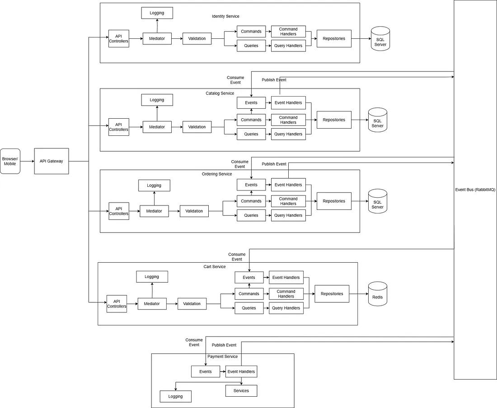

# First attempt to build Microservice-Based API with .NET Core, Clean Architecture, and DDD

In today’s fast-paced digital landscape, businesses demand applications that can scale effortlessly while ensuring seamless updates and high availability. Microservices architecture provides the ideal blueprint for achieving these goals. In this article, I’ll share my first attempt of building a microservice-based API for an eCommerce platform.

## Planned Features

The features I planned to implement include:

- Basic CRUD operations for categories and products.
- Cart functionality, including updating and removing cart items.
- Order placement.
- User authentication and authorization via JWT.

## Microservices Architecture Overview



I have drawn out the above diagram to get the big picture of the architecture of the microservice I have been building.

Here are the planned services for this solution:

- **Catalog Service**: Manages products and categories, and facilitates product search.
- **Ordering Service**: Handles the order placement.
- **Payment Service**: A mock service that simulates payment processing for now.
- **Cart Service**: Manages shopping cart functionality, including adding and removing items.
- **Identity Service**: Handles user registration, login, and JWT-based authentication.

For user facing services like Catalog, Ordering, Cart and Identity services, I am organizing the service into four key layers following clean architecture:

1. **Domain (Class Library):** Contains the core business logic and entities following Domain-Driven Design.
2. **Application (Class Library):** Manages application-specific logic, commands, queries, and their handlers by following CQRS principles.
3. **Infrastructure (Class Library):** Implements data access, caching, and other infrastructure concerns.
4. **API (Web API):** Handles HTTP requests and responses via controllers.

## Infrastructure and Implementation

### Database

I’ve opted to use Microsoft SQL Server for the Catalog, Identity, and Ordering services, with different database for each service. In the future, if the Catalog service requires more flexible data storage or scalability, a document-based database like MongoDB could be more suitable. For Cart service I have chosen to store the cart data in a distributed cache, Redis.

### Inter-service Communication

The services communicate using integration events. I use **NServiceBus**, a commercial messaging framework, alongside **RabbitMQ** as the message broker. Alternatives like Azure Service Bus or Kafka can also be considered. To demonstrate inter-service communication, let’s take the order placement process as an example:

When a user places an order, the **Ordering Service** handles this action through the `PlaceOrderCommandHandler`. Once the order is successfully placed, the system updates its status to "Placed" and publishes an `OrderPlacedIntegrationEvent`. This event triggers the **Catalog Service** to verify the stock for the ordered items through the `OrderPlacedIntegrationEventHandler`. If any item is out of stock, the service publishes an `OrderItemsStockRejectedIntegrationEvent`. Otherwise, it publishes an `OrderItemsStockConfirmedIntegrationEvent`.

The **Ordering Service** listens for these stock-related events. If the stock is rejected, the `OrderItemsStockRejectedIntegrationEventHandler` updates the order status to "Canceled" by invoking the `UpdateOrderStatusToCanceledCommandHandler`. Conversely, if the stock is confirmed, the `OrderItemsStockConfirmedIntegrationEventHandler` updates the status to "StockConfirmed" and publishes an `OrderStatusChangedToStockConfirmedIntegrationEvent`.

Once the order reaches the “StockConfirmed” status, the **Payment Service** steps in by consuming the `OrderStatusChangedToStockConfirmedIntegrationEvent`. It attempts to process the payment. If successful, it publishes an `OrderPaymentSucceededIntegrationEvent`; if not, it publishes an `OrderPaymentFailedIntegrationEvent`.

The **Ordering Service** also consumes these payment events. For successful payments, the `OrderPaymentSucceededIntegrationEventHandler` marks the order as "Paid" and triggers the `OrderStatusChangedToPaidIntegrationEvent`. If the payment fails, the `OrderPaymentFailedIntegrationEventHandler` cancels the order.

Finally, the **Catalog Service** listens to the `OrderStatusChangedToPaidIntegrationEvent`. It adjusts the stock levels to reflect the completed purchase, ensuring the inventory remains accurate.

By using integration events, each service can communicate asynchronously, ensuring that the services remain decoupled, thus improving scalability and fault tolerance. This approach also allows for eventual consistency between services, where the state of one service may be delayed but will eventually catch up.

## Containerization with Docker

I am using Docker and Docker Compose for easy orchestration and deployment of the microservices, along with their dependencies like Redis, RabbitMQ, and SQL Server. Containerization ensures that the services are isolated, and Docker Compose enables easy setup and management of the entire stack.  
Here is my docker compose yml file:

```yml
services:
  redis-caching:
    image: redis:latest
    container_name: redis-caching
    restart: always
    ports:
      - 6379:6379
    networks:
      - app-network
  rabbitmq-broker:
    image: rabbitmq:4.0-management
    container_name: rabbitmq-broker
    ports:
      - 5672:5672
      - 15672:15672
    volumes:
      - ~/.docker-conf/rabbitmq/data/:/var/lib/rabbitmq/
      - ~/.docker-conf/rabbitmq/log/:/var/log/rabbitmq
    environment:
      RABBITMQ_DEFAULT_USER: guest
      RABBITMQ_DEFAULT_PASS: guest
    networks:
      - app-network
  mssql-database:
    image: mcr.microsoft.com/mssql/server:2022-latest
    container_name: mssql-database
    environment:
      ACCEPT_EULA: 'Y'
      MSSQL_SA_PASSWORD: 'Passw0rd'
      MSSQL_DATA_DIR: /var/opt/mssql/data
      MSSQL_PID: 'Developer'
      MSSQL_TCP_PORT: 1433
    ports:
      - 1433:1433
    volumes:
      - ./data:/var/opt/mssql/data
      - ./log:/var/opt/mssql/log
      - ./secrets:/var/opt/mssql/secrets
    networks:
      - app-network
  identity-api:
    image: ${DOCKER_REGISTRY-}identityapi
    container_name: identity-api
    build:
      context: .
      dockerfile: src/Identity/Identity.API/Dockerfile
    ports:
      - 5006:8080
      - 5007:8081
    depends_on:
      - mssql-database
      - rabbitmq-broker
    networks:
      - app-network
  catalog-api:
    image: ${DOCKER_REGISTRY-}catalogapi
    container_name: catalog-api
    build:
      context: .
      dockerfile: src/Catalog/Catalog.API/Dockerfile
    ports:
      - 5000:8080
      - 5001:8081
    depends_on:
      - mssql-database
      - rabbitmq-broker
    networks:
      - app-network
  cart-api:
    image: ${DOCKER_REGISTRY-}cartapi
    container_name: cart-api
    build:
      context: .
      dockerfile: src/Cart/Cart.API/Dockerfile
    ports:
      - 5002:8080
      - 5003:8081
    depends_on:
      - mssql-database
      - rabbitmq-broker
      - redis-caching
    networks:
      - app-network
  ordering-api:
    image: ${DOCKER_REGISTRY-}orderingapi
    container_name: ordering-api
    build:
      context: .
      dockerfile: src/Ordering/Ordering.API/Dockerfile
    ports:
      - 5004:8080
      - 5005:8081
    depends_on:
      - mssql-database
      - rabbitmq-broker
    networks:
      - app-network
  payment-processor:
    image: ${DOCKER_REGISTRY-}paymentprocessor
    container_name: payment-processor
    build:
      context: .
      dockerfile: src/Payment/Payment.Processor/Dockerfile
    ports:
      - 5008:8080
      - 5009:8081
    depends_on:
      - mssql-database
      - rabbitmq-broker
    networks:
      - app-network
  api-gateway:
    image: ${DOCKER_REGISTRY-}apigateway
    container_name: api-gateway
    build:
      context: .
      dockerfile: src/ApiGateway/Dockerfile
    ports:
      - 7000:8080
      - 7001:8081
    depends_on:
      - identity-api
      - catalog-api
      - cart-api
      - ordering-api
      - payment-processor
    networks:
      - app-network
networks:
  app-network:
    driver: bridge
```

## API Gateway Setup and Configuration

An API gateway will handle incoming HTTP requests and forward them to the appropriate downstream service, facilitating a single entry point.  
For the API gateway I have added a web API project without controllers and setup ocelot with the ocleot.json configuration below:

```json
{
  "GlobalConfiguration": {
    "BaseUrl": "https://localhost:8081",
    "AllowInvalidCertificates": true
  },
  "Routes": [
    {
      "UpstreamPathTemplate": "/api/catalog/{everything}",
      "UpstreamHttpMethod": ["GET", "POST", "PUT", "DELETE"],
      "DownstreamPathTemplate": "/api/{everything}",
      "DownstreamScheme": "http",
      "DownstreamHostAndPorts": [
        {
          "Host": "catalog-api",
          "Port": 8080
        }
      ]
    },
    {
      "UpstreamPathTemplate": "/api/b/{everything}",
      "UpstreamHttpMethod": ["GET", "POST", "PUT", "DELETE"],
      "DownstreamPathTemplate": "/api/{everything}",
      "DownstreamScheme": "http",
      "DownstreamHostAndPorts": [
        {
          "Host": "cart-api",
          "Port": 8080
        }
      ]
    },
    {
      "UpstreamPathTemplate": "/api/o/{everything}",
      "UpstreamHttpMethod": ["GET", "POST", "PUT", "DELETE"],
      "DownstreamPathTemplate": "/api/{everything}",
      "DownstreamScheme": "http",
      "DownstreamHostAndPorts": [
        {
          "Host": "ordering-api",
          "Port": 8080
        }
      ]
    },
    {
      "UpstreamPathTemplate": "/api/identity/{everything}",
      "UpstreamHttpMethod": ["GET", "POST", "PUT", "DELETE"],
      "DownstreamPathTemplate": "/api/{everything}",
      "DownstreamScheme": "http",
      "DownstreamHostAndPorts": [
        {
          "Host": "identity-api",
          "Port": 8080
        }
      ]
    }
  ]
}
```

After setting up the API gateway I have removed UseHttpsRedirection from the Program.cs of all the services except the gateway for now. This is because I was facing SSL certificate related error when ocelot was redirecting the request to the endpoints of the other services which can be solved by generating SSL certificates and installing them in the containers.

## Conclusion

Building a microservice-based API architecture demonstrates the potential of designing scalable, maintainable, and independently deployable systems. By integrating RabbitMQ for seamless inter-service communication, Ocelot for API Gateway management, and Docker for streamlined containerization, this project lays a solid foundation for a flexible and fault-tolerant system.

This project serves as a practical example of how microservices principles can be applied to real-world scenarios. Developers can draw inspiration from the use of asynchronous communication, clean architecture patterns, and containerization to tackle similar challenges in their own projects.

While this project currently implements basic features like CRUD operations, user authentication, and order management, it will remain a work in progress. I hope to continuously add more features, refine the architecture, and integrate tools that enhance its functionality and robustness. I’ll be sharing updates as I make progress, with the aim of inspiring and engaging with the community.

## References

- Github Repo — [https://github.com/sayyedulawwab/EcommerceMicroservices](https://github.com/sayyedulawwab/EcommerceMicroservices)
