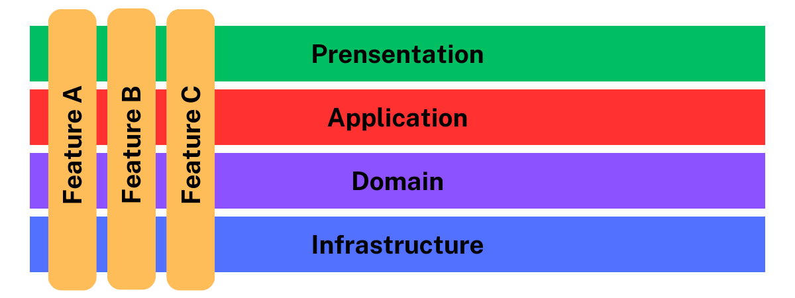
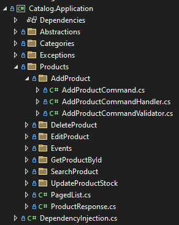
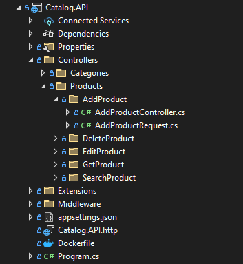

# Leveraging Vertical Slice Architecture with Clean Architecture for Scalable, Maintainable Systems

## Introduction

As software projects grow, the need for maintainability and modularity becomes even more critical. Recently, I decided to integrate **Vertical Slice Architecture** into my <a href="https://github.com/sayyedulawwab/EcommerceMicroservices" target="_blank">Ecommerce Microservices solution</a>. My goal was to organize the codebase around business use cases, making it more intuitive and scalable. In this article, I’ll walk you through my thought process, the decisions I made, and why I think this hybrid approach can boost both scalability and productivity.

## What is Vertical Slice Architecture?

At its core, Vertical Slice Architecture is all about organizing your code around **features or use cases**. Instead of dividing the codebase by **technical layers (like UI, business logic, and data access)**, each feature becomes a self-contained unit that houses everything it needs to execute its functionality. This is different from traditional layered architectures, which separate concerns into distinct layers.

## Why Combine Vertical Slices with Clean Architecture?

While Clean Architecture is great at separating concerns through technical layers, Vertical Slice Architecture focuses on organizing code around real-world business use cases. Combining these two approaches offers several key advantages:

- **Improved Maintainability:** With features isolated, changes are easier and less risky.
- **Better Alignment with Business Use Cases:** The structure reflects real-world scenarios, making it easier for developers to understand.
- **Scalability:** Each feature can grow independently, which is ideal for large-scale systems.
- **Compatibility:** The use-case focus in Clean Architecture meshes well with Vertical Slice principles, making the two approaches naturally complementary.

## When to choose which and when to combine?

Choosing between Vertical Slice and Clean Architecture really comes down to the needs of your project.

### Use Vertical Slice When:

You’re working on a larger, more complex system that needs to stand the test of time. Clean Architecture is ideal for projects where long-term scalability, maintainability, and clear separation of concerns are key.

### Opt for Clean Architecture When:

Long-term maintainability and scalability are crucial. Clean Architecture works well for large-scale systems that require strict separation of concerns and stability over time.

### Combine Both When:

You want the best of both worlds. If you’re building something large but need to keep development quick and feature-focused, a hybrid approach offers flexibility without sacrificing structure or scalability.

## My Implementation

Here’s how I applied his hybrid approach to my solution:

### Application Project Reorganization

The Application project is now organized by **features**, with each feature folder containing:

- Command and Query objects
- Handlers for business logic
- Validators for input validation
- Other necessary files

For example:

This structure makes it easy for developers to focus on a single feature at a time, simplifying development and testing.

### API Project Reorganization

The API project mirrors the Application project, with feature-based folders. Each folder contains a controller managing a single endpoint. This keeps everything consistent and organized, making it easier to navigate the codebase.

For example:

### Controllers vs. Minimal APIs

I briefly considered using Minimal APIs for defining endpoints but ended up sticking with controllers for now for the following reasons:

- Minimal APIs require additional code to register endpoints in `Program.cs`.
- While tools like FastEndpoints simplify this, I avoided adding dependencies since controllers are sufficient for the requirements.
- Switching to Minimal APIs would mean rewriting all existing controller-based endpoints.

While the third reason was the main deciding factor, I’m still open to using Minimal APIs for new services or features moving forward.

## Outcome and Benefits

Implementing this hybrid approach can result in several positive outcomes:

- **Clear Feature Boundaries:** Developers can focus on specific features without worrying about unrelated parts of the codebase.
- **Easier Testing and Debugging:** Because each feature is self-contained, isolating and fixing issues becomes simpler.
- **Greater Team Productivity:** Reduced cross-feature dependencies allow for parallel development and faster delivery.

## Conclusion

Integrating Vertical Slice Architecture into Clean Architecture has simplified feature development, making it easier to align with real-world business scenarios and scale the system efficiently. By combining the strengths of both approaches, we can achieve the best of both worlds—rapid feature development and long-term maintainability.

The decision of when to choose Vertical Slice, Clean Architecture, or a hybrid approach depends on your project’s needs. Whether you're focused on speed, long-term scalability, or a balance of both, understanding when and how to combine these architectures can lead to a more organized, modular, and scalable system.

Ultimately, there’s no one-size-fits-all solution. The key is to adapt your architecture to the unique challenges and goals of your project.

## References

- Ecommerce Microservices GitHub Repository - https://github.com/sayyedulawwab/EcommerceMicroservices
