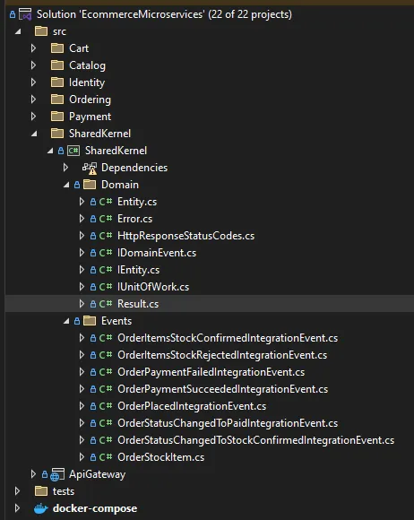

# Refactoring the E-Commerce Microservice Project — Introducing a Shared Kernel and Enhanced Error Handling

As I continued refining my E-Commerce Microservice project, I implemented significant improvements, including the introduction of a **Shared Kernel** and updates to the error-handling mechanism. This article walks through the thought process, changes made, and the benefits achieved.



## Shared Kernel: What and Why

In Domain-Driven Design (DDD), a Shared Kernel is a distinct type of Bounded Context that holds shared code and data used by multiple bounded contexts, such as Catalog, Ordering, and Identity, within the same domain (eCommerce). It acts as a centralized repository for ubiquitous language elements, common domain logic, and shared data structures relevant to all or specific bounded contexts.

### Why Did I Introduce a Shared Kernel?

In the original implementation, abstractions like `Result` and `Error` were defined independently across services. This approach posed a problem: any changes to these abstractions required modifying each service individually, which becomes cumbersome as the number of services grows. To address this, I centralized these common elements in a Shared Kernel, ensuring consistency and simplifying updates across the project.

## Enhancing Error Handling in REST APIs

In the current implementation of controllers, I was returning only two types of status codes:

- `200` for successful operations.
- `400` for bad requests.

However, REST APIs often require more granular status codes to represent different scenarios. For example, when editing a product, if the product ID does not exist in the database, the response should return a `404 Not Found` status instead of `400 Bad Request`.

### Initial Implementation

Handler method:

```csharp
public async Task<Result<long>> Handle(EditProductCommand request, CancellationToken cancellationToken)
{
    var product = await _productRepository.GetByIdAsync(request.id);

    if (product is null)
    {
        return Result.Failure<long>(ProductErrors.NotFound());
    }
    product = Product.Update(product, request.name, request.description,
        new Money(request.priceAmount, Currency.Create(request.priceCurrency)),
        request.quantity, request.categoryId, _dateTimeProvider.UtcNow);
    _productRepository.Update(product);
    await _unitOfWork.SaveChangesAsync();
    return product.Id;
}
```

Controller method:

```csharp
[HttpPut("{id}")]
public async Task<IActionResult> EditProduct(long id, EditProductRequest request, CancellationToken cancellationToken)
{
    var command = new EditProductCommand(id, request.name, request.description,
        request.priceCurrency, request.priceAmount, request.quantity, request.categoryId);

    var result = await _sender.Send(command, cancellationToken);
    if (result.IsFailure)
    {
        return BadRequest(result.Error);
    }
    return Ok(new { id = result.Value });
}
```

In this approach, every error, regardless of type, returned a `400 Bad Request` status code with error details.

## Introducing an Updated Error Object

To improve error handling and align with REST principles, I modified the `Error` record to include an additional property, `HttpResponseStatusCodes`, which represents the HTTP status code corresponding to the error.

### Original Implementation of `Error`

```csharp
public record Error(string Code, string Name)
{
    public static Error None = new(string.Empty, string.Empty);
    public static Error NullValue = new("Error.NullValue", "Null value was provided");
    public static Error NotFound = new("Error.NotFound", "Not Found");
}
```

### Revised Implementation of `Error`

```csharp
public record Error(string Name, string Description, HttpResponseStatusCodes Code)
{
    public static Error None = new(string.Empty, string.Empty, HttpResponseStatusCodes.InternalServerError);

    public static Error NullValue = new("Error.NullValue", "Null value was provided", HttpResponseStatusCodes.BadRequest);

    public static Error InternalServerError(string name, string description) =>
       new(name, description, HttpResponseStatusCodes.InternalServerError);

    public static Error NotFound(string name, string description) =>
        new(name, description, HttpResponseStatusCodes.NotFound);

    public static Error BadRequest(string name, string description) =>
        new(name, description, HttpResponseStatusCodes.BadRequest);

    public static Error Conflict(string name, string description) =>
        new(name, description, HttpResponseStatusCodes.Conflict);
}
```

I introduced an `HttpResponseStatusCodes` enum in the domain layer:

```csharp
public enum HttpResponseStatusCodes
{
    BadRequest = 400,
    NotFound = 404,
    Conflict = 409,
    InternalServerError = 500,
}
```

## Updated Controller Logic

With the revised `Error` object, I updated the controller logic to return the appropriate HTTP status code based on the error type:

```csharp
[HttpPut("{id}")]
public async Task<IActionResult> EditProduct(long id, EditProductRequest request, CancellationToken cancellationToken)
{
    var command = new EditProductCommand(id, request.name, request.description,
        request.priceCurrency, request.priceAmount, request.quantity, request.categoryId);

    var result = await _sender.Send(command, cancellationToken);

    if (result.IsFailure)
    {
        if (result.Error.Code == HttpResponseStatusCodes.NotFound)
        {
            return NotFound(result.Error);
        }
        return BadRequest(result.Error);
    }
    return Ok(new { id = result.Value });
}
```

## Streamlining with Error Mapping Extensions

To make the controller method cleaner, I introduced an `ErrorMappingExtensions` class to map errors to appropriate `IActionResult` objects:

```csharp
public static class ErrorMappingExtensions
{
    public static IActionResult ToActionResult(this Error error)
    {
        return error.Code switch
        {
            HttpResponseStatusCodes.NotFound => new NotFoundObjectResult(error),
            HttpResponseStatusCodes.BadRequest => new BadRequestObjectResult(error),
            HttpResponseStatusCodes.Conflict => new ConflictObjectResult(error),
            HttpResponseStatusCodes.InternalServerError => new ObjectResult(error)
            {
                StatusCode = StatusCodes.Status500InternalServerError
            },
            _ => new ObjectResult(error) { StatusCode = StatusCodes.Status500InternalServerError }
        };
    }
}
```

Using this extension, the controller becomes much cleaner:

```csharp
[HttpPut("{id}")]
public async Task<IActionResult> EditProduct(long id, EditProductRequest request, CancellationToken cancellationToken)
{
    var command = new EditProductCommand(id, request.name, request.description,
        request.priceCurrency, request.priceAmount, request.quantity, request.categoryId);

    var result = await _sender.Send(command, cancellationToken);

    if (result.IsFailure)
    {
        return result.Error.ToActionResult();
    }

    return Ok(new { id = result.Value });
}
```

With these modifications, I improved both maintainability and adherence to REST principles in my E-Commerce Microservice project. The introduction of a Shared Kernel ensures consistency across services, while the enhanced error-handling mechanism provides more meaningful and precise responses.

These changes not only simplify future development but also make the application more robust and scalable. I plan to apply these improvements across all controllers in all services, further streamlining the entire project.
